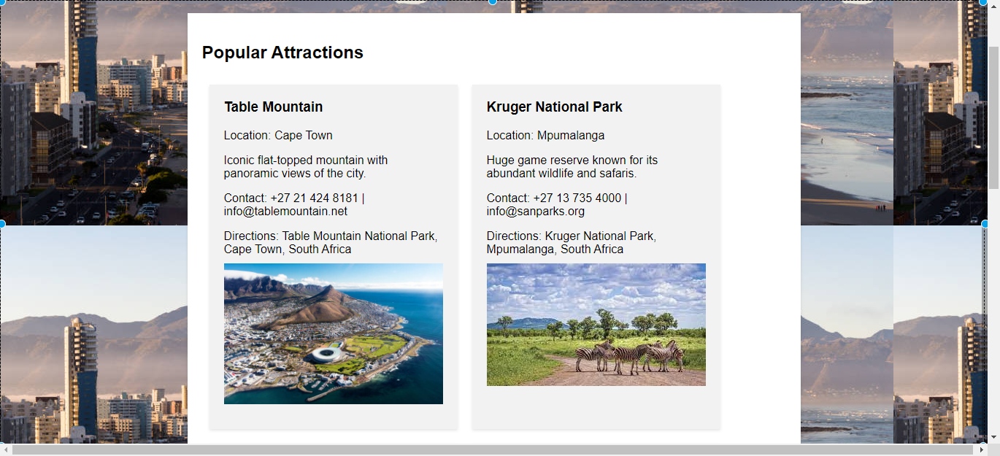

# Travel Planner - South Africa

Travel Planner is a web application designed to assist users in planning their trips to South Africa. Whether you're a local or a visitor, our app provides valuable information and resources to make your trip unforgettable.

## Features

- Discover popular attractions across South Africa
- Create personalized itineraries based on your preferences
- Get contact details and directions for each attraction
- Access valuable travel tips to enhance your experience

## Screenshots

## Technologies Used

- HTML5
- CSS3
- JavaScript

## Installation

1. Clone the repository: `git clone https://github.com/your-username/travel-planner.git`
2. Open the index.html file in your web browser.

## Contributing

Contributions are welcome! If you have any suggestions or want to report an issue, please submit a pull request or open an issue on the GitHub repository.

## License

This project is licensed under the [MIT License](LICENSE).

## Contact

If you have any questions or feedback, feel free to contact us at info@travelplanner.com.

---

Happy traveling!
